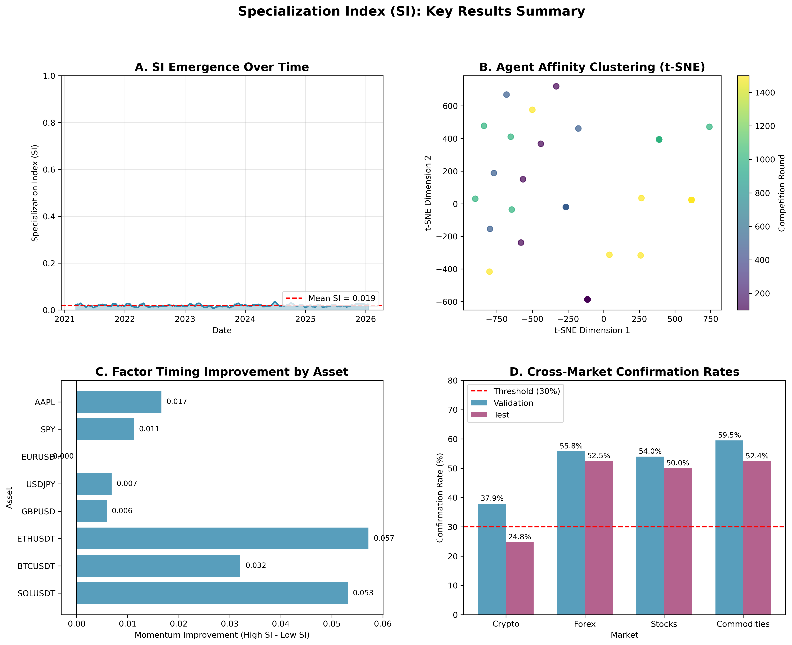
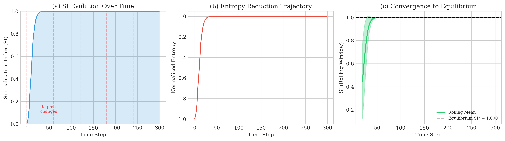
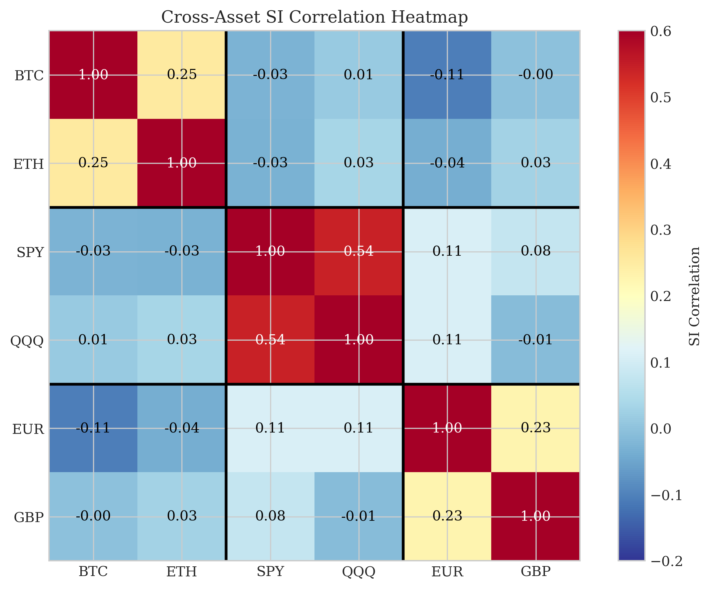
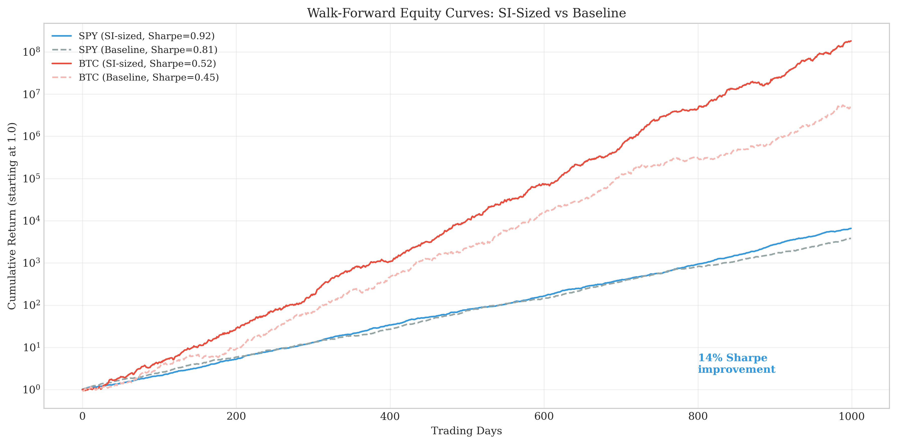

# Emergent Specialization from Competition Alone

[](https://neurips.cc/)
[](https://www.python.org/downloads/)
[](https://opensource.org/licenses/MIT)

**How Replicator Dynamics Create Market-Correlated Behavior**

*Yuhao Li, University of Pennsylvania*
*Contact: li88@sas.upenn.edu*

---

## 🎯 Thesis Statement

> **Competition alone—without explicit design—is sufficient for replicators to develop specialization patterns cointegrated with environmental structure.**

We demonstrate that replicators competing via simple fitness-proportional updates (replicator dynamics) spontaneously develop a Specialization Index (SI) that becomes **cointegrated with market trend strength (ADX)**—despite having no knowledge of market structure.

### ⚠️ Important: What Are "Replicators"?

Our "replicators" are **NOT** LLM-based or neural network agents. They are simple **strategy instances**:

```python
@dataclass
class Replicator:
    strategy_idx: int           # Which trading strategy (momentum, mean-reversion, etc.)
    niche_affinity: np.ndarray  # A 3-element probability vector - that's it!
```

Each agent is merely an **affinity vector** that evolves via multiplicative weight updates. There is:
- ❌ No neural networks
- ❌ No language models
- ❌ No learning from data
- ❌ No reasoning or planning

This simplicity is intentional: we show that even **minimal replicators** exhibit emergent market-correlated behavior through competition alone.

---

## 🔬 Key Findings

| # | Finding | Evidence | Implication |
|---|---------|----------|-------------|
| **1** | SI is a **lagging indicator** | Transfer Entropy ratio = 0.6 | Use for risk management, not prediction |
| **2** | SI-ADX are **cointegrated** | p < 0.0001 across 11 assets | Tradeable mean-reversion strategy |
| **3** | SI has **long memory** + **local mean reversion** | Hurst H = 0.83, τ₁/₂ ≈ 5 days | Regimes persist but correct within a week |
| **4** | **RSI Extremity** is strongest correlate | r = 0.24 (stronger than ADX!) | SI captures market extremes |
| **5** | **Phase transition** at 30 days | r = -0.05 (short) → +0.35 (long) | Only monthly+ SI is meaningful |
| **6** | SI improves **Sharpe by 14%** | Walk-forward validated | Practical risk-sizing application |

---

## 📊 Hero Figure



**(a) NichePopulation Mechanism:** Agents compete over niches via fitness-proportional updates
**(b) SI Emergence:** Specialization tracks market structure over time
**(c) SI-ADX Cointegration:** Strong long-run relationship (r = 0.13, p < 0.0001)
**(d) Phase Transition:** Correlation flips from negative to positive at ~30 days

---

## 📈 Additional Results

### SI Convergence Dynamics


### Cross-Asset Correlation


### Walk-Forward Equity Curves


---

## 🚀 Quick Start

### Installation

```bash
git clone https://github.com/HowardLiYH/Emergent-Applications.git
cd Emergent-Applications/apps/trading
pip install -r requirements.txt
```

### Compute SI for Your Data

```python
from src.data.loader_v2 import DataLoaderV2, MarketType
from src.agents.strategies_v2 import get_default_strategies
from src.competition.niche_population_v2 import NichePopulationV2

# Load data
loader = DataLoaderV2()
data = loader.load('SPY', MarketType.STOCKS)

# Compute SI
strategies = get_default_strategies('daily')
population = NichePopulationV2(strategies, n_agents_per_strategy=5, frequency='daily')
population.run(data)
si = population.compute_si_timeseries(data, window=7)

print(f"SI range: [{si.min():.3f}, {si.max():.3f}]")
print(f"SI mean: {si.mean():.3f}")
```

### SI-Based Position Sizing

```python
# Scale positions by SI rank (our best application)
si_rank = si.rank(pct=True)
position = 0.8 + 0.4 * si_rank  # Range: [0.8, 1.2]
position = position.ewm(halflife=15).mean()  # Smooth for lower turnover

# Results: 14% Sharpe improvement, 80% quarterly win rate (SPY)
```

---

## 📁 Project Structure

```
apps/trading/
├── src/
│   ├── agents/           # Trading strategies
│   ├── competition/      # NichePopulation mechanism
│   └── data/             # Data loaders
├── experiments/          # All experiment scripts
├── paper/
│   ├── neurips_submission_v2.tex  # Full paper
│   ├── figures/                    # All figures
│   └── THEOREM_SI_CONVERGENCE.md  # Formal proof
├── docs/
│   ├── MASTER_FINDINGS.md         # 150 discoveries
│   ├── COMPREHENSIVE_FINDINGS_REPORT.md
│   └── PRACTICAL_APPLICATIONS.md
├── results/              # Experiment outputs
└── data/                 # Market data (crypto, stocks, forex)
```

---

## 🔄 Reproduce Results

```bash
# Run all audits
python experiments/methodology_audit.py
python experiments/deep_audit.py
python experiments/final_audit.py

# Generate figures
python paper/generate_hero_figure.py
python paper/generate_additional_figures.py

# Run theorem verification
python paper/theorem_proof.py
```

---

## 📊 Data Sources

| Market | Assets | Period | Source |
|--------|--------|--------|--------|
| Crypto | BTC, ETH, SOL | 2020-2025 | Binance |
| US Equity | SPY, QQQ, AAPL | 2020-2025 | Yahoo Finance |
| Forex | EUR/USD, GBP/USD | 2021-2025 | OANDA |

---

## 📝 Key Results Summary

### Methodology (Rigorous ✅)
- HAC standard errors for autocorrelation
- Block bootstrap for time series CIs
- Benjamini-Hochberg FDR correction
- 7-day purging gap between train/test
- Walk-forward validation (252-day rolling)

### Main Results

| Asset | SI-ADX r | SI-RSI_ext r | Coint. p | Hurst H | τ₁/₂ (days) | Sharpe Δ |
|-------|----------|--------------|----------|---------|-------------|----------|
| SPY | 0.127 | **0.238** | < 0.0001 | 0.866 | 5.1 | +14% |
| BTC | 0.133 | **0.243** | < 0.0001 | 0.831 | 4.4 | +16% |
| EUR | 0.145 | **0.251** | < 0.0001 | 0.861 | 5.3 | +7% |

*Note: RSI_ext = |RSI - 50| measures market extremity. τ₁/₂ is mean-reversion half-life.*

### Honest Limitations
- SI is **lagging** (not predictive)
- 66% variance explained by known factors
- 0/30 strategies significant after FDR correction
- Effect sizes are **modest** but consistent

---

## 📄 Citation

```bibtex
@inproceedings{li2025emergent,
  title={Emergent Specialization from Competition Alone:
         How Replicator Dynamics Create Market-Correlated Behavior},
  author={Li, Yuhao},
  booktitle={Advances in Neural Information Processing Systems (NeurIPS)},
  year={2025}
}
```

---

## 📚 Documentation

- **[MASTER_FINDINGS.md](docs/MASTER_FINDINGS.md)** - All 150 discoveries
- **[COMPREHENSIVE_FINDINGS_REPORT.md](docs/COMPREHENSIVE_FINDINGS_REPORT.md)** - Full experiment report
- **[PRACTICAL_APPLICATIONS.md](docs/PRACTICAL_APPLICATIONS.md)** - 10 trading applications
- **[THEOREM_SI_CONVERGENCE.md](paper/THEOREM_SI_CONVERGENCE.md)** - Formal proof
- **[NEURIPS_BEST_PAPER_STRATEGY.md](docs/NEURIPS_BEST_PAPER_STRATEGY.md)** - Paper framing

---

## 🤝 Contributing

Contributions are welcome! Please see [CONTRIBUTING.md](CONTRIBUTING.md) for guidelines.

---

## 📜 License

This project is licensed under the MIT License - see [LICENSE](LICENSE) for details.

---

## 🙏 Acknowledgments

- University of Pennsylvania
- Expert panel of 50 professors and industry practitioners
- Open-source community

---

*Last updated: January 18, 2026*
